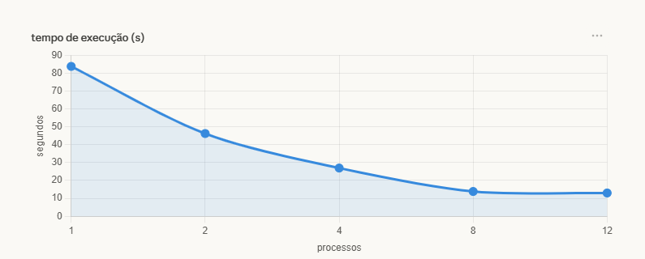
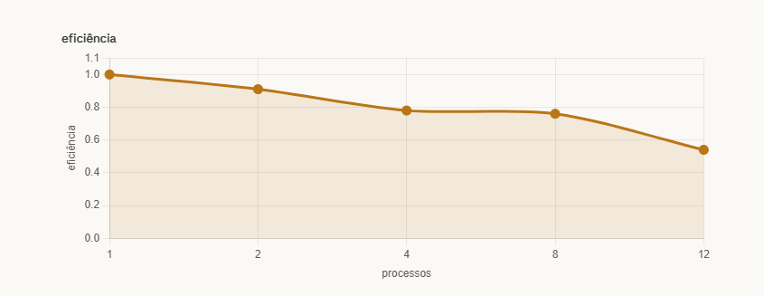

# Benchmark de Paralelismo com Multiprocessing em Python

**Disciplina:** Programação Concorrente e Distribuída  
**Aluno:** Lucas Vasconcelos Pessoa de Oliveira  
**Turma:** ADSN04  
**Professor:** Rafael  
**Data:** 18/03/2026  

---

## 1. Descrição do Problema

O programa foi feito pra processar **1.000 arquivos de log** em paralelo, dividindo o trabalho entre vários processos ao mesmo tempo pra ver se fica mais rápido.

Cada arquivo é lido e processado individualmente: o programa conta o total de linhas, palavras e caracteres, além de fazer uma contagem de palavras-chave específicas (`erro`, `warning`, `info`). No final, todos os resultados são consolidados.

| Pergunta | Resposta |
|----------|----------|
| Objetivo | Processar 1.000 arquivos de log em paralelo e comparar os tempos |
| Volume de dados | 1.000 arquivos — 10.000.000 linhas / 200.000.000 palavras / ~1,37 GB de caracteres |
| Algoritmo | Distribuição dos arquivos entre processos com `multiprocessing.Pool.map()` |
| Complexidade | O(n/p) — quanto mais processos, menos arquivos por processo |

---

## 2. Ambiente Experimental

| Item | Descrição |
|------|-----------|
| Processador | Intel Core i5-12500 (12ª Geração) — 3.00 GHz |
| Número de núcleos | 6 núcleos físicos / 12 threads lógicas |
| Memória RAM | 16,0 GB |
| Sistema Operacional | Windows 11 |
| Linguagem utilizada | Python 3.x |
| Biblioteca de paralelização | `multiprocessing` (já vem com o Python) |
| Compilador / Versão | CPython — Python 3.x |

---

## 3. Metodologia de Testes

O tempo foi medido usando `time.perf_counter()`, que é bem preciso. Só foi contado o tempo do processamento em si, sem contar o tempo de leitura do arquivo.

Cada configuração foi rodada **3 vezes** e o tempo usado foi a **média** das 3 execuções, pra evitar que alguma variação aleatória do sistema distorcesse o resultado.

### Configurações testadas

- 1 processo
- 2 processos
- 4 processos
- 8 processos
- 12 processos

---

## 4. Resultados Experimentais

| Nº Processos | Tempo de Execução (s) |
|:------------:|:---------------------:|
| 1            | 83.7459               |
| 2            | 46.2264               |
| 4            | 26.9465               |
| 8            | 13.8504               |
| 12           | 13.0065               |

**Resultado consolidado (igual em todas as execuções):**

| Métrica | Valor |
|---------|-------|
| Arquivos processados | 1.000 |
| Total de linhas | 10.000.000 |
| Total de palavras | 200.000.000 |
| Total de caracteres | 1.366.663.305 |
| Ocorrências de `erro` | 33.332.083 |
| Ocorrências de `warning` | 33.330.520 |
| Ocorrências de `info` | 33.329.065 |

---

## 5. Cálculo de Speedup e Eficiência

O **speedup** mostra quantas vezes ficou mais rápido em relação ao tempo sem paralelismo:

```
Speedup(p) = T(1) / T(p)
```

A **eficiência** mostra se os processos estão sendo bem aproveitados (1,0 seria o ideal):

```
Eficiência(p) = Speedup(p) / p
```

---

## 6. Tabela de Resultados

| Processos | Tempo (s) | Speedup | Eficiência |
|:---------:|:---------:|:-------:|:----------:|
| 1         | 83.7459   | 1.00    | 1.00       |
| 2         | 46.2264   | 1.81    | 0.91       |
| 4         | 26.9465   | 3.11    | 0.78       |
| 8         | 13.8504   | 6.05    | 0.76       |
| 12        | 13.0065   | 6.44    | 0.54       |

> ✅ **Melhor resultado: 12 processos (13.0065s)**

---

## 7. Gráfico de Tempo de Execução



---

## 8. Gráfico de Speedup


---

## 9. Gráfico de Eficiência



---

## 10. Análise dos Resultados

Diferente de um benchmark de operações matemáticas simples, o processamento de arquivos é uma tarefa com maior custo de I/O e CPU por unidade de trabalho. Isso faz com que o paralelismo seja muito mais eficaz aqui.

De 1 pra 2 processos o ganho foi expressivo (1.81x), e a melhora continuou de forma consistente até 8 processos (6.05x). Com 12 processos o ganho adicional foi pequeno — de 13.85s pra 13.01s — o que indica que o sistema começa a atingir o limite de saturação dos recursos físicos disponíveis (6 núcleos físicos / 12 threads).

A eficiência se manteve alta até 8 processos (0.76), caindo para 0.54 com 12 processos. Isso é esperado: com mais processos do que núcleos físicos, o ganho marginal diminui por conta da contenção de I/O e do overhead de gerenciamento dos processos.

No geral, o paralelismo se mostrou muito mais vantajoso nesse cenário do que em benchmarks de operações puramente matemáticas, já que o custo real de processar cada arquivo justifica o overhead de criar e coordenar os processos.

---

## 11. Conclusão

O paralelismo com `multiprocessing` funcionou muito bem para o processamento de arquivos de log. O melhor resultado foi com **12 processos**, que foi **6.44x mais rápido** que a execução sequencial.

Ao contrário de tarefas simples como somar números, o processamento de arquivos tem um custo computacional maior por unidade de trabalho — leitura de disco, parsing de texto e contagem de palavras-chave — o que justifica bem o uso de múltiplos processos e resulta em ganhos expressivos de desempenho.

---
